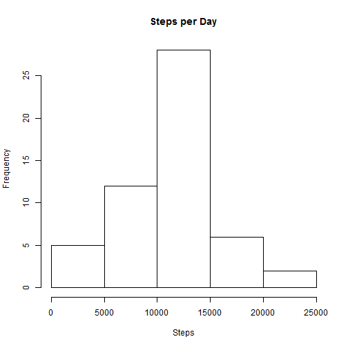
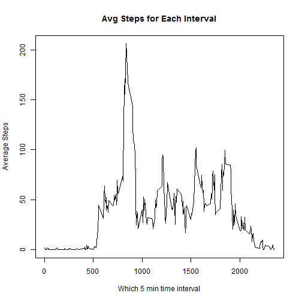
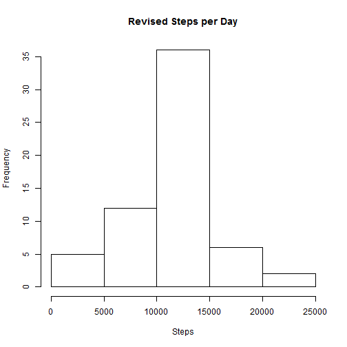
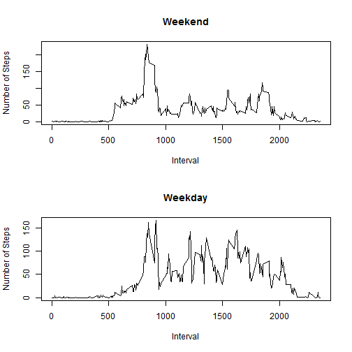

## Loading and preprocessing the data
First, we load the activity data, and ensure the steps are numeric.


```r
activity <- read.csv("repdata-data-activity/activity.csv")
```
## What is mean total number of steps taken per day?
We will have to do a lot of aggregate/ counting. We take advantage of the sqldf package.


```r
library(sqldf)
hist_data <- sqldf("select date, sum(steps) 'sum' from activity group by date")
hist_data $ sum <- as.numeric(hist_data $ sum)
```

The following shows a histogram of total steps per day


```r
hist(as.numeric(hist_data $ sum), main = "Steps per Day", xlab = "Steps")
```

 

We get the mean and median by the built in R functions. (Set the scipen options so the numbers display correctly)

```r
mean <- mean(hist_data $ sum, na.rm = TRUE)
median <- median(hist_data $ sum, na.rm = TRUE)
options("scipen" = 100)
```

The mean steps per day is 10766.1886792, while the median is 10765.

## What is the average daily activity pattern?
Now, lets aggregate instead on the interval, and make the graph.


```r
time_series <- sqldf("select interval, avg(steps) 'avg' from activity group by interval")
plot(time_series, type = "l", ylab = "Average Steps", xlab = "Which 5 min time interval", main = "Avg Steps for Each Interval")
```

 

We can easily select the max using subset & max functions.

```r
max_avg_steps <- subset(time_series, avg == max(time_series $ avg, na.rm = TRUE)) $ interval
```

So the interval: 835 has the most average steps.

## Inputing missing values
Now, we get a data frame of all the 5 minute periods where steps were not recorded.

```r
na_steps <- subset(activity, is.na(steps))
```

There are 2304 missing values in the data set. We will try to correct this, filling the out with the interval average from time_series. First copy over activity to activity_corrected, and then merge in our time_series data (by interval). Finally we use sql's case statement to choose the average if steps are null.


```r
activity_corrected <- activity
activity_corrected <- merge(activity_corrected, time_series)
activity_corrected <- sqldf("select date, case when steps is null then avg else steps end 'steps', interval from activity_corrected")
```

Then we can build the histogram, as before. Then we calculate the mean and median as before.

```r
hist_data_new <- sqldf("select date, sum(steps) 'sum' from activity_corrected group by date")
hist(as.numeric(hist_data_new $ sum), main = "Revised Steps per Day", xlab = "Steps")
```

 

```r
mean_new <- mean(hist_data_new $ sum, na.rm = TRUE)
median_new <- median(hist_data_new $ sum, na.rm = TRUE)
```

The mean steps per day is 10749.7704918, while the median is 10641. See the change in the histogram. As expected, the mean and median are different, since instead of ignoring NA values, we filled in the missing data with averages. This data set shows a decrease since the data is skewed to the left.

## Are there differences in activity patterns between weekdays and weekends?
Let's add a factor variable of weekends to our activity data set. Let's copy activity_corrected over to activity_wkday, and then add a weekday column, and the appropriate factors.

```r
activity_wkday <- activity_corrected
activity_wkday $ wkday <- weekdays(as.POSIXct(activity_wkday $ date))
activity_wkday $ wkend_flag <- as.factor(ifelse(activity_wkday $ wkday %in% c("Saturday", "Sunday"), 1, 0))
wkday <- sqldf("select interval, avg(steps) from activity_wkday where wkend_flag = 0 group by interval")
wkend <- sqldf("select interval, avg(steps) from activity_wkday where wkend_flag = 1 group by interval")
```

Now lets plot this!

```r
par(mfrow = c(2,1))

#first is weekend
plot(wkday, 
     type = "l", xlab = "", ylab = "")

title(main = "Weekend", ylab = "Number of Steps", xlab = "Interval")

#then comes weekday
plot(wkend, 
     type = "l", xlab = "", ylab = "")

title(main = "Weekday", ylab = "Number of Steps", xlab = "Interval")
```

 
